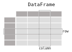



First things first, let's import `pandas`. 

```python
import pandas as pd
```

## Data types in `pandas`

On top of all the usual Python object types, `pandas` has two main types of its own: `Series` and `DataFrame`. These are both containers for labelled data.

A `Series` is a 1-dimensional container, similar to a list, with some extra functionality. A `DataFrame` is essentially a collection of `Series`. You can think of a `DataFrame` as a table (like in Microsoft Excel or a SQL database), with `Series` for columns. 

 



> ## Pandas has two main objects
> 
> - A `Series` contains 1-dimensional, labelled data - like a vector, or a column
> - A `DataFrame` contains 2-dimensional, labelled data - like a matrix, or a table
{: .callout}

Most of the time you'll be probably interacting with `DataFrames`. However, many of same principles apply to both `Series` and `DataFrames`, and the concepts are easier to understand when we're just looking at a single dimension, so we'll learn a bit about `Series` to start with. 

## Key concepts for a `Series`

We can create a `Series` from a `list`, a `range`, or a `dict`:

```python
integers = pd.Series([0, 1, 2, 3, 4])
evens = pd.Series(range(0, 10, 2)) # range(start, stop, step) 
ordinals = pd.Series({1: 'first', 2: 'second', 3: 'third', 4: 'fourth'})

print(f"integers (from list):\n{integers}\n")
print(f"evens (from range):\n{evens}\n")
print(f"ordinals (from dict):\n{ordinals}\n")
```

```output
integers (from list):
0    0
1    1
2    2
3    3
4    4
dtype: int64

evens (from range):
0    0
1    2
2    4
3    6
4    8
dtype: int64

ordinals (from dict):
1     first
2    second
3     third
4    fourth
dtype: object
```

There are a few things to notice here. We'll go through the important points.

### Access data by its label using `loc[]`

Each of the `Series` has a set of labels, shown on the left in the output above. This is the index. Data elements can be accessed via these labels, using the function `Series.loc`:

```python
print(integers.loc[2])
print(evens.loc[2])
print(ordinals.loc[2])
```

```output
2
4
second
```

> The `loc` function let's us access data using its label. It takes values in square brackets `[]`
{: .callout}

For `integers` and `evens`, we just passed in a sequence of values and `pandas` automatically created an index, using numbers starting from zero. To create `ordinals`, we passed in a `dict`, which already includes labels. `pandas` used these labels to create the index. Note that in our case, the labels are all integers, but they don't have to be - for example, they could be strings, or dates. 

> Indexes contain the labels for data. They are often sequences of integers, but they don't have to be.
{: .callout}

### Access data by its position using `iloc[]`

Sometimes we might want to access data in a specific _position_, rather than by using its index label. `pandas` provides another function for this, called `iloc`:

```python
print(integers.iloc[0])
print(evens.iloc[0])
print(ordinals.iloc[0])
```

```output
0
0
first
```

> The `iloc` function let's us access data using its position. Like `loc`, it takes values in square brackets `[]`
{: .callout}

> Note that `iloc` is "0-indexed" - the first element is number 0, the i-th element is number i-1.
{: .callout}

What if we want to get more than one value at a time? We can use `loc` and `iloc` for that too. 

### Get multiple values by passing a list to `loc[]`

If we give `loc` a list of labels, we'll get back just the values indexed by those labels:

```python
evens.loc[[1, 3]]
```

```output
1    2
3    6
dtype: int64
```

### Get a slice of data with a colon `:`

With `iloc` we can specify a range of values using a colon `:`. This is called a slice:

```python
ordinals.iloc[1:3]
```

```output
2    second
3     third
dtype: object
```

Note that the slice contains everything up to but **not including** the second value in the range. 

> Slicing a `Series` using `iloc[start:stop]` returns a range of values at the positions `start` to `stop-1`. 
{: .callout}

If we omit a value on either side of the colon, the range will extend to the end of the `Series` - so `[:2]` is equivalent to `[0:2]`.

> ## Challenge
> 
> Can you guess what happens when you call `iloc[:]` with no numbers? 
>
> > ## Solution
> > You get the whole `Series`
> >
> > ```python
> > ordinals.loc[:]
> > ```
> >
> > ```output
> > 1     first
> > 2    second
> > 3     third
> > 4    fourth
> > dtype: object
> > ```
> {: .solution}
{: .challenge}

### Filter data on conditions using boolean indexing

You can select only the subset of data that meets specific criteria using a technique called boolean indexing. To get the integers that are greater than 2, we can use:

```python
integers.loc[integers > 2]
```

```output
3    3
4    4
dtype: int64
```

What's happening here? The `>` operator compares each element of `integers` to 2, and returns `True` or `False` for each one. This creates a `Series`:

```python
evens > 2
```

```output
0    False
1    False
2     True
3     True
4     True
dtype: bool
```

We're then passing this `Series` into `loc` and using it to tell pandas whether or not we want each value. 

We can use all of the comparison operators we looked at in day one.

- `<`: "less than"
- `>`: "greater than"
- `==`: "equal to" (note the double equals symbol!)
- `<=`: "less than or equal to"
- `>=`: "greater than or equal to"
- `!=`: "not equal to"

You can combine criteria using logical operators with the symbols `|` for "or", `&` for "and", and `~` for "not". For example, we can get even numbers that are greater than 3 and less than 8 using:

```python
evens.loc[(evens > 3) & (evens < 8)]
```

```output
2    4
3    6
dtype: int64
```

